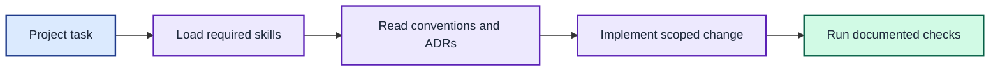

# Agent instructions

These instructions apply to the complete `joshpeak-prompt/` subtree.

Agents load the project skills and memory before making a scoped, verified change.

## Load the required skills

Always load and follow the `librarian`, `gooddocs`, and `richdocs` skills before
planning or editing this project. Use `librarian` for document placement and
cross-links. Use `gooddocs` to verify claims against code and Make targets. Use
`richdocs` for generated HTML companions.

Every project-authored Markdown document must contain a relevant Mermaid
diagram. Invoke `mermaidjs_diagrams` for diagram work and pass its complexity
and WCAG contrast gates. Do not apply this rule to APM-installed skill content.

The [apm.yml](apm.yml) manifest installs these skills from the canonical
`neozenith/agentic-dotfiles` source and records the selected skill subset.

## Check project memory first

Before raising an open design question, check [adrs/README.md](adrs/README.md)
and self-answer from existing decisions where possible. Record each new binding
decision as an ADR rather than rewriting an accepted ADR.

Use the canonical terms in [GLOSSARY.md](GLOSSARY.md) for identifiers, docs, and
prose. Add a new domain term to the glossary in the same change that introduces
it.

Follow [docs/CONVENTIONS.md](docs/CONVENTIONS.md) before creating, moving, or
renaming documentation.

## Preserve compatibility

- Treat the legacy shell output as a byte-level contract.
- Keep stdout free of timing and diagnostic data.
- Keep every disposable file under the relative `tmp/` directory.
- Use the Makefile for development commands.
- Maintain 100% statement coverage.
- Do not fix a legacy output defect without an explicit compatibility decision.
