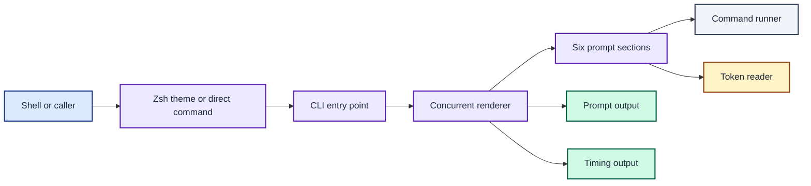
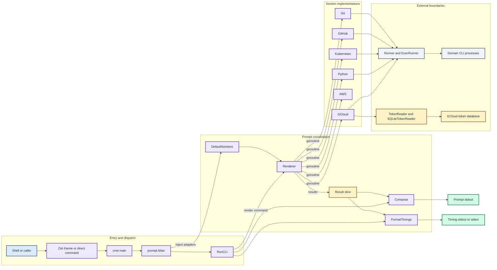
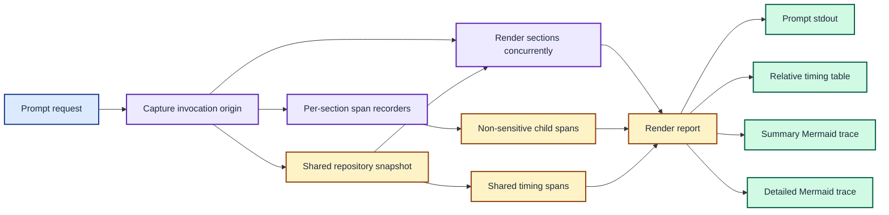
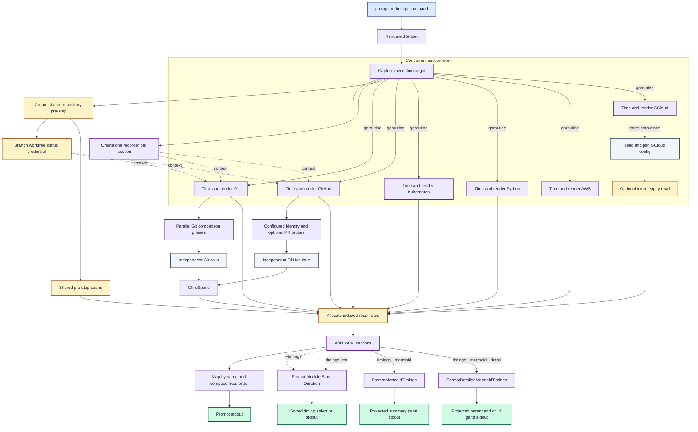
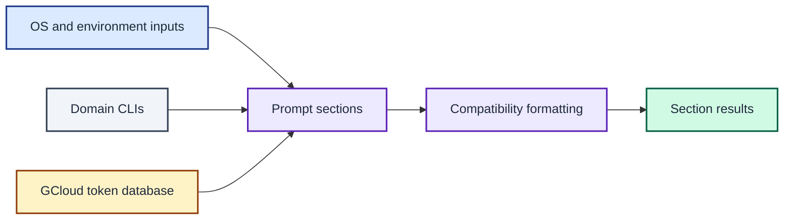
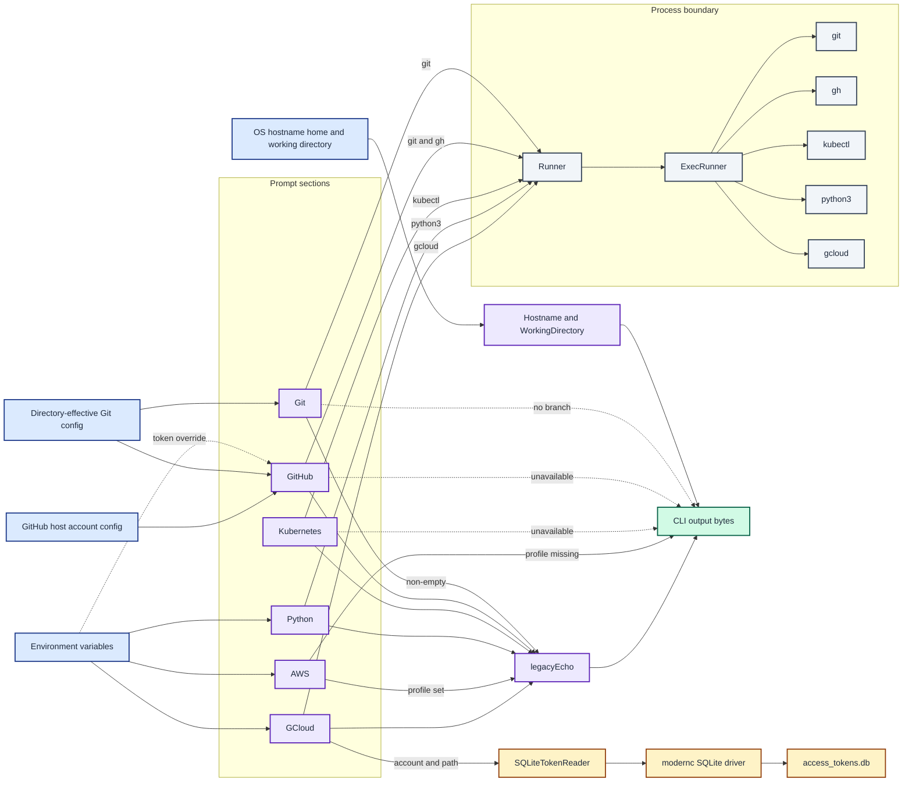
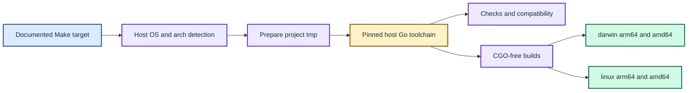
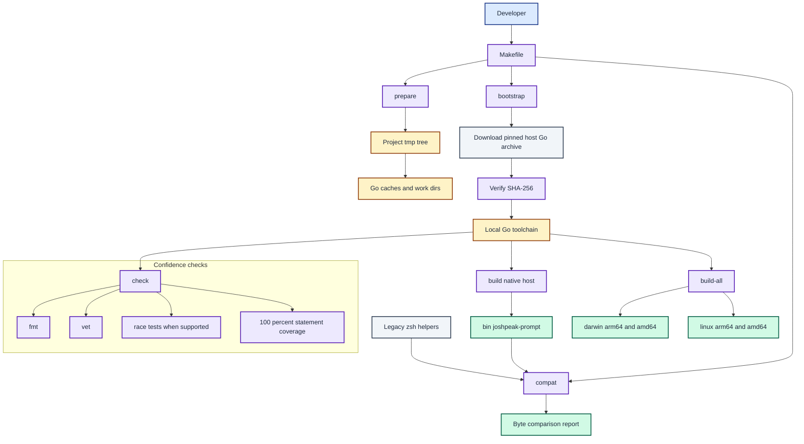

# Architecture

`joshpeak-prompt` is a small Go CLI with one runtime package. It replaces six
zsh prompt helpers while preserving their output bytes, runs the prompt sections
concurrently, and keeps timing data separate from prompt output.

The diagrams below present the system through four lenses. Each overview is
followed by a detailed source map for maintainers.

---

<b>Table of Contents</b>

<!--TOC-->

- [Architecture](#architecture)
  - [System components](#system-components)
  - [Prompt rendering and timing](#prompt-rendering-and-timing)
  - [External integration and data flow](#external-integration-and-data-flow)
  - [Build and portability](#build-and-portability)

<!--TOC-->

---

## System components

The executable composes the CLI, concurrent renderer, prompt sections, and two
ports for external commands and token storage.

The CLI sends configured sections through a concurrent renderer, with external access isolated behind command and token ports.

Explore the detailed component map

The composition root injects concrete adapters, while the renderer coordinates six section implementations and the CLI chooses the output stream.

Source: [`joshpeak.zsh-theme`](../zsh/themes/joshpeak.zsh-theme),
[`main.go`](cmd/joshpeak-prompt/main.go),
[`cli.go`](internal/prompt/cli.go), [`prompt.go`](internal/prompt/prompt.go),
and [`runner.go`](internal/prompt/runner.go). See
[ADR 0001](adrs/0001-preserve-output-with-concurrent-renderers.md) for the
concurrency decision.

## Prompt rendering and timing

The renderer captures one invocation origin, creates one span recorder per
section, creates one shared repository pre-step, and starts one goroutine per
section. Git and GitHub consume the same repository snapshot and schedule only
their remaining independent probes. The render report carries section results
and invocation-level shared spans separately.

The report separates one shared repository trace from section results before the CLI selects an output projection.

Follow the complete render and timing sequence

The shared pre-step produces one repository snapshot and one timing lane, while section-specific probes retain their own child spans.

`Compose` preserves literal separators even when a section is empty. The text
table has `Module`, `Start`, and `Duration` columns and sorts rows from slowest
to fastest. `prompt --timings` writes this table to stderr, while `timings`
writes it to stdout.

`timings --mermaid` preserves the configured section order and writes a complete
fenced `gantt` block to stdout. The block uses `dateFormat x`,
`axisFormat %S.%L`, and `tickInterval 1millisecond`. The projection drops the
sub-millisecond remainder from each non-negative start and rounds each positive
duration up to a whole millisecond. Every projected duration is at least 1 ms
so that fast sections remain visible.

`timings --mermaid --detail` emits one Mermaid section per prompt section. Each
trace begins with one shared Git pre-step lane containing branch, worktree,
origin, and credential spans. Each prompt section then contains its parent total
followed by section-specific child spans sorted by start time and operation
label. Git records email, local-base, remote discovery, and indexed remote
comparisons. GitHub normally records a local `read configured account` span and
records a pull-request operation only when the branch requires it. The local
account read overlaps the repository snapshot. An environment token replaces
that span with `resolve environment account`, which needs one API request.

All timing labels are maintainer-authored and value-free. They never contain
command arguments, subprocess output, remote names, account names, or paths.
The default timing table and summary Mermaid trace ignore child spans and retain
their existing output shapes. The detailed trace has flat invocation and
per-section spans rather than a general nested tracing model.

Named section commands bypass the concurrent renderer and render only the
requested section.

Source: [`Renderer.Render`, `Compose`, `FormatTimings`, and
`FormatMermaidTimings`](internal/prompt/prompt.go), [`runWithSpan`](internal/prompt/trace.go),
[`RunCLI`](internal/prompt/cli.go), [`Git.Render`](internal/prompt/git.go), and
[`GitHub.Render`](internal/prompt/github.go), with repository discovery in
[`repository.go`](internal/prompt/repository.go).
See [ADR 0002](adrs/0002-treat-legacy-output-as-a-byte-contract.md) for the
byte contract and [ADR 0007](adrs/0007-export-relative-timing-traces-as-fenced-mermaid.md)
for the timing projection. [ADR 0008](adrs/0008-record-non-sensitive-hierarchical-subprocess-spans.md)
defines the child-span boundary.
[ADR 0009](adrs/0009-parallelise-and-coalesce-prompt-probes.md) defines the
intra-section dependency graphs and invocation-scoped sharing boundary.
[ADR 0010](adrs/0010-build-one-shared-git-pre-step.md) replaces the
per-command sharing boundary with one repository snapshot and timing lane.
[ADR 0011](adrs/0011-compare-configured-github-identity-with-git-credentials.md)
defines the identity-coherence check and removes normal-path authentication
validation.
[ADR 0012](adrs/0012-mark-binary-owned-prompt-rollups.md) defines the visible
binary marker and narrows the byte contract to named section output.
[ADR 0013](adrs/0013-adopt-the-binary-in-the-zsh-theme.md) supersedes that
temporary marker and adopts the binary as the zsh theme's prompt renderer.

## External integration and data flow

Generic host, path, text, and counting work uses the Go standard library.
Domain CLIs remain authoritative for their configured state. GCloud token
expiry is the only runtime database read.

Each section combines standard-library inputs with domain-owned state, then formats its result to preserve the shell contract.

Inspect every runtime integration

Runner isolates domain processes, SQLiteTokenReader isolates token storage, and legacy-formatted section paths share the escape-expansion helper.

`ExecRunner` ignores execution errors and returns any captured stdout after
trimming trailing newlines. Tests substitute the `Runner` and `TokenReader`
interfaces without starting real processes or opening a real user database.

The GitHub section compares Git's directory-effective credential username with
the GitHub CLI's effective identity. Its normal account lookup is local and does
not test token validity or scopes. Environment tokens override host config and
therefore require an API identity lookup; pull-request inspection remains a
separate conditional operation.

Source: [`runner.go`](internal/prompt/runner.go),
[`simple.go`](internal/prompt/simple.go), [`git.go`](internal/prompt/git.go),
[`github.go`](internal/prompt/github.go), [`gcloud.go`](internal/prompt/gcloud.go),
and [`echo.go`](internal/prompt/echo.go). See
[ADR 0004](adrs/0004-keep-domain-clis-and-embed-sqlite.md) for the dependency
boundary and [ADR 0011](adrs/0011-compare-configured-github-identity-with-git-credentials.md)
for the Git and GitHub identity boundary.

## Build and portability

The Makefile is the development entry point. It detects the host with `uname`,
pins and downloads the matching Go toolchain, confines disposable state to the
project `tmp/` tree, builds without CGO, and supports macOS and Linux on both
`arm64` and `amd64`.

Documented Make targets detect the host, prepare a local toolchain and caches, then check or build CGO-free binaries for macOS and Linux.

See the complete development pipeline

The pipeline verifies a pinned toolchain, runs four confidence checks, compares live output with the zsh oracle, and creates native or cross-built binaries.

The supported hosts are macOS and Linux on `arm64` and `amd64`. `build-all`
cross-builds and commits one `bin/joshpeak-prompt-<os>-<arch>` binary per target,
and the zsh theme selects the host's binary at load. The renderer and ports use
portable Go APIs, so a new operating system needs only its toolchain checksum,
a `build-all` target, and compatibility fixtures. On a 39-bit-VMA kernel the race
detector cannot initialise, so the `race` target runs the suite without it and
warns; other hosts still enforce it.

Source: [Makefile](Makefile),
[`check-legacy.zsh`](scripts/check-legacy.zsh), and [`go.mod`](go.mod). See
[ADR 0003](adrs/0003-keep-development-state-under-project-tmp.md) for local
temporary state and [ADR 0014](adrs/0014-support-linux-and-commit-per-architecture-binaries.md)
for the platform boundary and per-architecture binaries.
