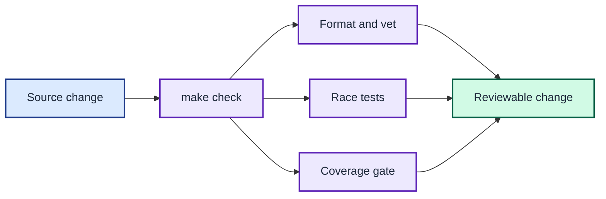

# Contributing to joshpeak-prompt

Use the Makefile for all development tasks. It pins the toolchain and keeps
disposable state inside the project's relative `tmp/` directory.



Every source change passes formatting, vetting, race-enabled tests, and the coverage gate before review.

## Run the confidence checks

Run the complete check before submitting a change:

```console
$ make check
```

This target formats the Go source, runs `go vet`, executes tests with the race
detector, and verifies statement coverage. `make coverage` prints the coverage
for each function when you need a faster report.

The `race` target probes race-detector support first. On a host whose kernel
cannot initialise ThreadSanitizer — such as a 39-bit-VMA Raspberry Pi OS kernel
on `linux/arm64` — it runs the suite without `-race` and prints a warning instead
of failing the gate. Hosts that support the detector continue to enforce it. See
[ADR 0014](adrs/0014-support-linux-and-commit-per-architecture-binaries.md).

## Build a local binary

Build the host executable into `bin/`:

```console
$ make build
```

`make build-all` cross-builds the four committed release binaries
(`bin/joshpeak-prompt-<os>-<arch>`) for macOS and Linux on `arm64` and `amd64`;
commit those when the source changes. Use `make clean` to remove `tmp/` and the
local unsuffixed build while preserving the committed release binaries. The next
Go-dependent Make target downloads the pinned toolchain again.

## Preserve the output contract

Treat every renderer's returned string as a byte-level API. Cover each new
branch with a table-driven case that asserts the complete output, including
colour tokens and whitespace.

The project keeps 100% statement coverage because an unexecuted compatibility
branch can silently change prompt bytes. Run `make compat` as a separate
cross-language check against the current shell environment.

Keep standard-library replacements for host, path, and text processing. Add an
external command only when that command remains the authority for the state,
such as Git or a cloud CLI.

Check [adrs/README.md](adrs/README.md) before changing an accepted design. Add
a superseding ADR when the change modifies a binding decision.
