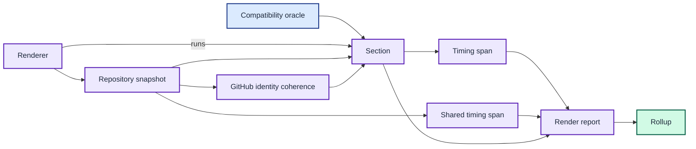

# Glossary

This glossary defines the canonical terms used in code, documentation, and
agent conversations.

The compatibility oracle defines section bytes, while the renderer records shared and section timing spans before the ordered rollup.

| Term | Definition |
| --- | --- |
| Compatibility oracle | The applicable legacy zsh helpers whose output defines expected behaviour. |
| GitHub identity coherence | Equality between the credential username selected by Git's directory-effective configuration and the effective GitHub CLI account. The normal path reads the configured account without validating authentication; an environment-token override requires API identity resolution. |
| Host binary selection | The theme-load resolution that maps the host's `uname` output to `bin/joshpeak-prompt-<os>-<arch>`, honours an explicit `JOSHPEAK_PROMPT_BIN`, and falls back to the unsuffixed local build. |
| Per-architecture binary | One committed release executable named `bin/joshpeak-prompt-<os>-<arch>`, cross-built by `make build-all` for each supported macOS and Linux target. |
| Prompt section | One independently rendered unit, such as Git, AWS, or Python. |
| Render report | The complete result of one renderer invocation, containing ordered prompt-section results and invocation-level shared timing spans. |
| Renderer | The coordinator that renders configured prompt sections concurrently and records their results. |
| Repository snapshot | One invocation-scoped set of branch, worktree marker, status, and credential values consumed by both the Git and GitHub prompt sections; the pre-step resolves origin as the credential lookup input. |
| Rollup | The ordered concatenation of all prompt section outputs. |
| Section | A Go implementation that produces one prompt section's legacy-compatible text. |
| Shared probe | One invocation-scoped subprocess result recorded once outside individual prompt sections. |
| Shared timing span | An invocation-level timing record for one shared probe, rendered in the detailed trace's shared pre-step lane. |
| Timing result | A prompt section's name, output, start offset, duration, and zero or more child timing spans from one renderer invocation. |
| Timing span | A prompt section's child record containing a maintainer-authored, value-free operation label, start offset, and duration for one section-specific subprocess request. |
