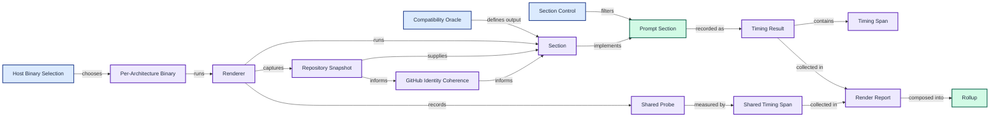

# Glossary

This glossary defines the canonical terms used in code, documentation, and agent conversations.

Keep the Mermaid concept map current whenever a term or relationship changes.
Use Title Case for every domain term in the map, headings, and definitions so readers recognise each term as a named concept.

```mermaid
flowchart LR
    Oracle["Compatibility Oracle"]:::input -->|defines output| Section["Section"]:::process
    Host["Host Binary Selection"]:::input -->|chooses| Binary["Per-Architecture Binary"]:::process
    Binary -->|runs| Renderer["Renderer"]:::process
    Control["Section Control"]:::input -->|filters| PromptSection["Prompt Section"]:::output
    Renderer -->|runs| Section
    Renderer -->|captures| Snapshot["Repository Snapshot"]:::process
    Renderer -->|records| Probe["Shared Probe"]:::process
    Snapshot -->|informs| Coherence["GitHub Identity Coherence"]:::process
    Snapshot -->|supplies| Section
    Coherence -->|informs| Section
    Section -->|implements| PromptSection
    PromptSection -->|recorded as| TimingResult["Timing Result"]:::process
    TimingResult -->|contains| Span["Timing Span"]:::process
    Probe -->|measured by| SharedSpan["Shared Timing Span"]:::process
    TimingResult -->|collected in| Report["Render Report"]:::process
    SharedSpan -->|collected in| Report
    Report -->|composed into| Rollup["Rollup"]:::output

    classDef input fill:#dbeafe,stroke:#1e3a8a,color:#1e293b,stroke-width:2px
    classDef process fill:#ede9fe,stroke:#5b21b6,color:#1e293b,stroke-width:2px
    classDef output fill:#d1fae5,stroke:#065f46,color:#1e293b,stroke-width:2px
```

The Compatibility Oracle defines Section bytes.
Section Control filters Prompt Sections, while the Renderer records Timing Spans and Shared Timing Spans before composing the Rollup.

## Compatibility Oracle

The applicable legacy zsh helpers whose output defines expected behaviour.

## GitHub Identity Coherence

Equality between the credential username selected by Git's directory-effective configuration and the effective GitHub CLI account.
The normal path reads the configured account without validating authentication; an environment-token override requires API identity resolution.

## Host Binary Selection

The theme-load resolution that maps the host's `uname` output to `bin/joshpeak-prompt-<os>-<arch>`, honours an explicit `JOSHPEAK_PROMPT_BIN`, and falls back to the unsuffixed local build.

## Per-Architecture Binary

One committed release executable named `bin/joshpeak-prompt-<os>-<arch>`, cross-built by `make build-all` for each supported macOS and Linux target.

## Prompt Section

One independently rendered unit, such as Git, AWS, or Python.

## Render Report

The complete result of one Renderer invocation, containing ordered Prompt Section results, invocation-level Shared Timing Spans, and total wall duration.

## Renderer

The coordinator that renders configured Prompt Sections concurrently and records their results.

## Repository Snapshot

One invocation-scoped set of branch, worktree marker, status, and credential values consumed by both the Git and GitHub Prompt Sections.
The pre-step resolves origin as the credential lookup input.

## Rollup

The ordered concatenation of enabled Prompt Section outputs.

## Section Control

An environment variable or CLI flag that prevents a named Prompt Section from rendering.

## Section

A Go implementation that produces one Prompt Section's legacy-compatible text.

## Shared Probe

One invocation-scoped subprocess result recorded once outside individual Prompt Sections.

## Shared Timing Span

An invocation-level timing record for one Shared Probe, rendered in the detailed trace's shared pre-step lane.

## Timing Result

A Prompt Section's name, output, start offset, duration, and zero or more child Timing Spans from one Renderer invocation.

## Timing Span

A Prompt Section's child record containing a maintainer-authored, value-free operation label, start offset, and duration for one section-specific subprocess request.
