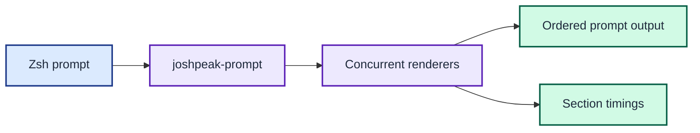

# joshpeak-prompt

`joshpeak-prompt` replaces the `zsh/scripts/function_parse_*.sh` prompt
helpers with one Go executable. It renders each section concurrently, preserves
the legacy output bytes, and reports optional timings separately from prompt
output.



The CLI runs independent renderers concurrently, then emits prompt text in legacy order while retaining separate timing data.

## Build the CLI

The build supports Apple silicon and Intel macOS. The Makefile downloads its
pinned Go toolchain and keeps all disposable files under this project's
relative `tmp/` directory.

```console
$ make build
$ bin/joshpeak-prompt aws
 %F{052}☁️  aws_profile_not_set%F{rc}%K{rc}
```

The repository's [`joshpeak.zsh-theme`](../zsh/themes/joshpeak.zsh-theme) calls
the binary once per prompt. Set `JOSHPEAK_PROMPT_BIN` before theme loading to
test an alternate build. The default `prompt` command preserves the six legacy
sections' ordering and separators. Zsh startup no longer sources those render
functions or runs its former branch-detection precmd hook.

## Inspect section timings

Run the timing report directly:

```console
$ bin/joshpeak-prompt timings
Module       Start       Duration
git          +11.0µs     69.3ms
gh           +20.8µs     38.8ms
```

The durations depend on local tools, repositories, credentials, and network
latency. Each start is relative to that render invocation. `prompt --timings`
writes prompt text to stdout and timings to stderr.

Write a fenced detailed trace to the project-local temporary tree:

```console
$ mkdir -p tmp/timings
$ bin/joshpeak-prompt timings --mermaid --detail > tmp/timings/prompt.md
```

The detailed trace groups each prompt section's total with its recorded child
spans. Its `shared git pre-step` lane records the one repository snapshot used
by both Git and GitHub, including branch, worktree, origin, and credential
probes. The Git and GitHub lanes contain only their remaining section-specific
work. The normal GitHub identity check reads the locally configured account in
parallel with that snapshot; it does not validate authentication. If `GH_TOKEN`
or `GITHUB_TOKEN` overrides the configured account, one API request resolves the
effective identity. See [ADR 0011](adrs/0011-compare-configured-github-identity-with-git-credentials.md).
Omit `--detail` for the summary trace. The generated file is disposable and is
not a checked-in preview.

## Choose a command

Run `joshpeak-prompt` with no argument to render the complete helper rollup.
The source of truth for command names is the usage string in
[`RunCLI`](internal/prompt/cli.go).

The `hostname` command replaces `current_hostname` from
`function_path_tools.sh`. The `directory` command replaces the theme's `%~`
expansion. Domain CLI dependencies remain only where those tools define the
source behaviour, as recorded in [ADR 0004](adrs/0004-keep-domain-clis-and-embed-sqlite.md).

## Develop the project

See [CONTRIBUTING.md](CONTRIBUTING.md) for the verified development workflow.
The [architecture guide](ARCHITECTURE.md) maps the runtime, integrations, and
build pipeline. Architectural decisions are indexed in
[adrs/README.md](adrs/README.md), and project terminology lives in
[GLOSSARY.md](GLOSSARY.md). Run `make compat` to compare every live section with
its legacy helper.

## Compatibility boundary

The current shell helpers remain the compatibility oracle. This project
preserves their ANSI and zsh colour tokens, whitespace, empty outputs, fallback
values, and the Git helper's empty local rebase count. The zsh theme now uses the
binary directly, while the legacy scripts remain available to `make compat`.
See [ADR 0013](adrs/0013-adopt-the-binary-in-the-zsh-theme.md).

The first target is macOS. The Go packages avoid macOS-specific APIs, while the
Makefile currently bootstraps only macOS toolchains.
