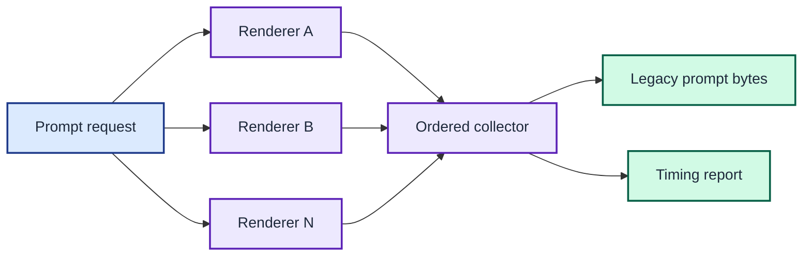

# ADR 0001: Preserve output with concurrent renderers

| Status | Date |
| --- | --- |
| Accepted | 2026-08-14 |

## Context

The zsh theme runs six `function_parse_*.sh` helpers for every prompt. Several
helpers wait on independent CLIs, while gcloud also starts a separate SQLite
process. Their combined latency blocks each prompt.

The replacement must preserve the current text for every input state. Even a
reasonable formatting correction can disrupt the theme or hide an identity
warning.

## Decision

Implement one renderer per prompt section behind a shared interface. Run all
renderers concurrently, store their output and duration separately, then
concatenate results in the legacy order.

Keep timing reports off prompt stdout. Replace hostname, path, and text tools
with Go's standard library. Use the CGO-free `modernc.org/sqlite` driver for the
gcloud token query, while retaining domain CLIs as state authorities.

Keep all disposable development files in the project's relative `tmp/`
directory. Bootstrap both Apple silicon and Intel macOS toolchains through the
Makefile, with code structured for later operating-system builds.

Renderers run independently, while the collector preserves legacy output order and keeps timing data separate.

## Consequences

Prompt latency approaches the slowest section instead of the sum of all
sections. Tests can isolate every renderer and cover its output permutations.

The Git renderer preserves a legacy empty local rebase count. A future fix
requires a compatibility decision and an intentional output migration.

The pure-Go SQLite dependency increases the binary and module graph. It removes
the runtime requirement for the `sqlite3` executable and avoids a CGO toolchain.
