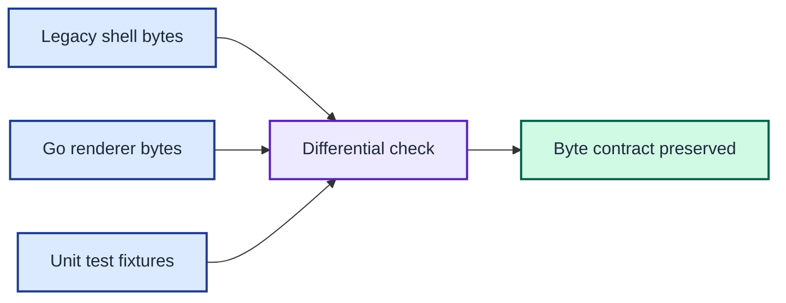

# ADR 0002: Treat legacy output as a byte contract

| Status | Date |
| --- | --- |
| Accepted | 2026-08-14 |

## Context

The Go CLI replaces prompt helpers that feed directly into zsh prompt
expansion. Colour tokens, leading spaces, blank sections, escape expansion, and
existing defects can all affect the visible prompt.

A cleaner output format would make migration easier to reason about. It would
also turn the replacement into a prompt redesign and break unknown shell
configurations.

## Decision

Treat each legacy helper's stdout bytes as its compatibility contract. Preserve
zsh `echo -e` expansion and the Git helper's empty local rebase count. Keep
timings and diagnostics on separate streams.

Use complete expected strings in unit tests. Use the live differential check to
compare all six Go sections with their shell counterparts in the current
environment.

Differential checks and complete fixtures compare Go output with the legacy shell byte contract.

## Consequences

The first release can replace all helper calls without changing the theme's
format. A legacy defect remains until a later ADR defines an intentional output
migration.

Statement coverage protects every implemented branch, while differential checks
protect the cross-language boundary. Neither measure substitutes for the other.
