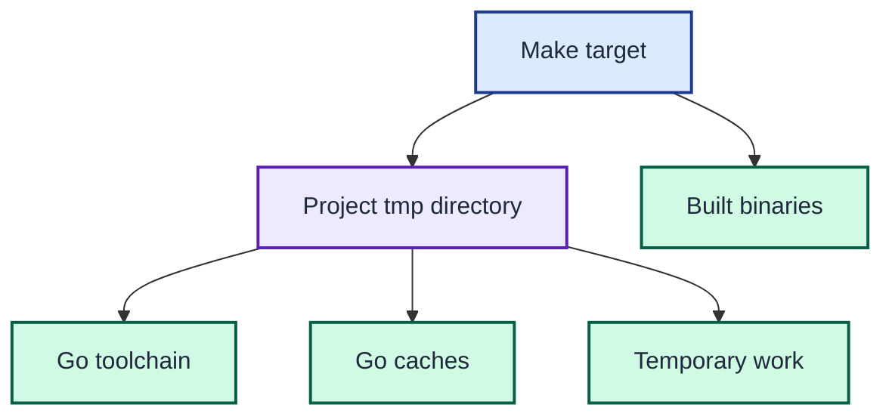

# ADR 0003: Keep development state under project tmp

| Status | Date |
| --- | --- |
| Accepted | 2026-08-14 |

## Context

The host may not have Go installed and may deny writes to user-level cache or
system temporary directories. Hidden state outside the repository also makes a
development run harder to reproduce and clean up.

## Decision

Use the Makefile as the development entry point. Bootstrap a checksum-verified
Go toolchain for the current macOS architecture and place every disposable file
under the project's relative `tmp/` directory.

Set the Go caches, module cache, GOPATH, `TMPDIR`, and `GOTMPDIR` to children of
that directory. Keep built deliverables in `bin/`, and remove both trees through
the documented clean target.

Make confines disposable toolchains, caches, and work files to the project tmp directory while keeping deliverables in `bin/`.

## Consequences

Development works without a global Go installation or writable user cache. The
temporary tree is large because it contains the toolchain and module graph, but
one clean operation removes it without touching user-level state.
