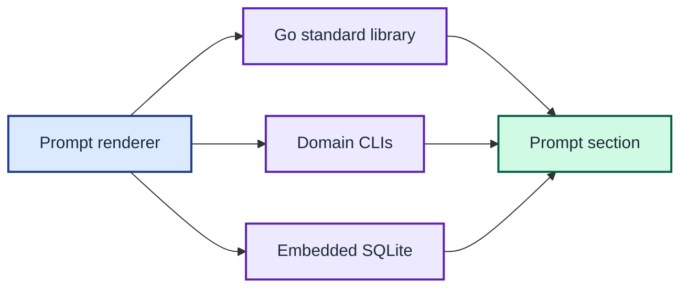

# ADR 0004: Keep domain CLIs and embed SQLite

| Status | Date |
| --- | --- |
| Accepted | 2026-08-14 |

## Context

The shell helpers mix two dependency classes. Text, host, path, and counting
tools duplicate Go standard-library capabilities. Git, GitHub, Kubernetes,
Python, and Google Cloud commands remain authorities for their configured
state.

The gcloud helper also requires the `sqlite3` executable only to read one cached
token expiry value.

## Decision

Replace generic host and text utilities with Go standard-library code. Resolve
executable paths with `exec.LookPath`, while retaining domain CLIs for state
owned by those tools.

Read the gcloud token database through the CGO-free `modernc.org/sqlite` driver.
Build with `CGO_ENABLED=0` so the resulting executable has no C toolchain or
runtime SQLite dependency.

The renderer uses the standard library for generic work, domain CLIs for owned state, and embedded SQLite for cached token data.

## Consequences

The prompt no longer depends on `hostname`, `uname`, `sed`, `grep`, `wc`, `tr`,
`which`, or `sqlite3`. It still requires each domain CLI when its section needs
that CLI's state.

The embedded SQLite driver increases the binary and module graph. It makes token
inspection portable across supported Go architectures.
