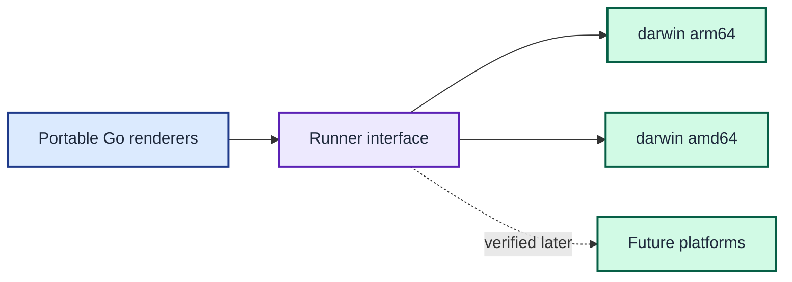

# ADR 0005: Target macOS with portable Go boundaries

| Status | Date |
| --- | --- |
| Accepted | 2026-08-14 |

## Context

The prompt currently runs on macOS, across Apple silicon and Intel machines.
Adding operating-system abstractions before another platform needs them would
increase the initial migration cost.

Locking the implementation to Apple-only APIs would make a later port needlessly
expensive.

## Decision

Support `darwin/arm64` and `darwin/amd64` first. Bootstrap the matching macOS Go
toolchain and provide a cross-build target for both architectures.

Keep renderer code on portable Go APIs and isolate process execution behind the
runner interface. Do not promise another operating system until its domain CLI
behaviour and compatibility fixtures are verified.

Portable renderer code reaches both macOS architectures through the runner boundary and leaves other platforms for later verification.

## Consequences

The first release has a clear support boundary and produces both macOS binaries.
Future operating-system support can reuse the renderer packages, but it needs a
new toolchain bootstrap path and compatibility evidence.
