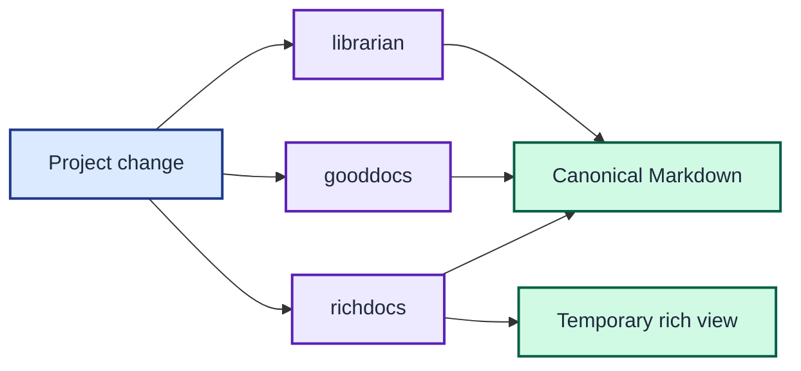

# ADR 0006: Make documentation an agent-maintained system

| Status | Date |
| --- | --- |
| Accepted | 2026-08-14 |

## Context

The CLI's correctness depends on details that are easy to erase during routine
maintenance. These include output bytes, dependency boundaries, temporary-file
containment, and accepted legacy defects.

Documentation can drift if agents treat it as optional prose after code changes.

## Decision

Install `librarian`, `gooddocs`, and `richdocs` from the canonical
`neozenith/agentic-dotfiles` source through APM. Require agents to use these
skills for project work and keep the lockfile as the resolved record.

Every project-authored Markdown document contains a relevant Mermaid diagram.
Run the Mermaid complexity and WCAG contrast gates before accepting a diagram.
Generate rich HTML companions under `tmp/richdocs/` when a document benefits
from interactive rendering.

The required skills keep canonical Markdown organised, accurate, and visual while rich companions remain temporary.

## Consequences

Documentation placement, truth, and presentation become repeatable checks.
Generated rich documents remain disposable, while Markdown stays canonical.

Small policy documents carry small diagrams even when prose alone could explain
them. This is a deliberate consistency rule for this project.
