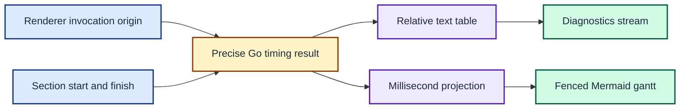

# ADR 0007: Export relative timing traces as fenced Mermaid

| Status | Date |
| --- | --- |
| Accepted | 2026-08-14 |

## Context

A duration table identifies slow prompt sections, but it does not show when
each concurrent section started. Absolute wall-clock timestamps would add
irrelevant host time and make separate invocations difficult to compare.

Mermaid Gantt diagrams can show overlap in Markdown. Mermaid accepts whole
milliseconds for this numeric timeline, while Go records the measurements as
more precise `time.Duration` values.

## Decision

Capture one origin at the start of each `Renderer.Render` invocation. Store
each section's start offset from that origin and its duration in the section's
`Result`. Keep these Go values as the precise measurement record.

Keep the text report as a separate projection with `Module`, `Start`, and
`Duration` columns. Stable-sort its rows by duration from slowest to fastest.
Write the table to stderr for `prompt --timings` and to stdout for `timings`.

Add `timings --mermaid` as a second projection. Preserve configured section
order and write a complete fenced Mermaid `gantt` block to stdout. Configure
the block with `dateFormat x`, `axisFormat %S.%L`, and
`tickInterval 1millisecond`.

Project each non-negative start by dropping its sub-millisecond remainder.
Round each positive duration up to the next whole millisecond and use at least
1 ms for every duration. This projection is intentionally lossy so that fast
sections remain visible in Mermaid.

The renderer keeps precise relative measurements, while each formatter chooses an output order, precision, and diagnostic stream for its audience.

## Consequences

The text table can diagnose launch delay as well as elapsed work. The Mermaid
trace makes section overlap visible and can be redirected directly into a
temporary Markdown file without adding fence markers by hand.

The Gantt block is a visual projection, not the measurement record. Several
sub-millisecond starts can share the same displayed start, and rounding can
make displayed durations longer than their precise Go values.

Prompt output remains unchanged. Timing tables and timing traces stay on
diagnostic streams selected by the command mode.
