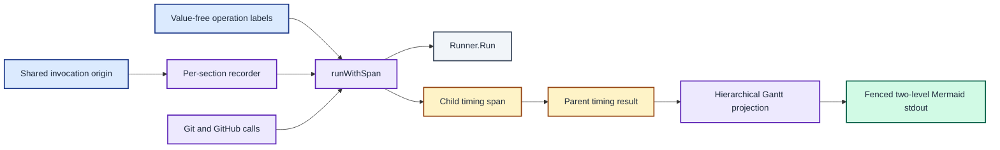

# ADR 0008: Record non-sensitive hierarchical subprocess spans

| Status | Date |
| --- | --- |
| Accepted | 2026-08-14 |

## Context

[ADR 0007](0007-export-relative-timing-traces-as-fenced-mermaid.md) records one
relative total per prompt section. That total identifies a slow section, but it
cannot identify which subprocess call consumed the time inside Git or GitHub.

Command arguments and outputs can contain remote URLs, account names, paths, or
other local data. A useful detailed trace must expose subprocess timing without
copying those values into Markdown.

## Decision

Extend each timing result with zero or more child timing spans. A span stores a
maintainer-authored, value-free operation label, a start offset from the shared
renderer invocation origin, and a duration. Create a separate recorder for each
prompt section and pass it through that section's context.

Wrap selected Git and GitHub `Runner.Run` calls with `runWithSpan`. Use labels
that describe operation categories rather than command arguments or results.
Git labels cover branch, origin, identity, worktree, local-base, and remote
comparisons. GitHub labels cover worktree, account, origin, identity, branch,
and pull-request operations. Number repeated remote comparisons by index rather
than recording a remote name.

Do not record command arguments, subprocess output, remote names, account names,
or paths in a span. Sections without instrumented subprocess calls retain an
empty child-span list.

Add `timings --mermaid --detail` as a two-level projection of the same results.
Emit one Mermaid section per prompt section, then its parent total, then its flat
child spans in recorded order. The current Git and GitHub calls are synchronous,
so recorded order matches their conditional source execution order. Apply ADR
0007's fenced Markdown format and lossy whole-millisecond projection to both
levels.

Keep the default timing table and `timings --mermaid` summary unchanged. The
detailed trace writes to stdout, like the summary trace, and never changes
prompt stdout.

Each recorder captures timing and a value-free label, while subprocess arguments and output remain outside the two-level trace.

## Consequences

The detailed trace can distinguish subprocess latency from section-local Go
work. Parent durations need not equal the sum of child durations because a
section can perform formatting, path lookup, or uninstrumented work.

Git and GitHub gain child detail without changing their prompt bytes. Other
sections show only a parent total until their subprocess boundaries receive
the same privacy review and instrumentation.

Operation labels become a maintained diagnostic interface. New labels must
remain value-free, and repeated operations must use indexes rather than local
identifiers. The span model has no parent identifier, so it does not represent
arbitrary nesting below the section total.
