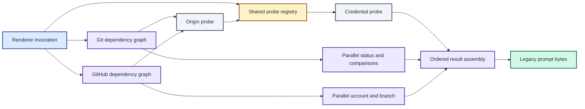

# ADR 0009: Parallelise and coalesce prompt probes

| Status | Date |
| --- | --- |
| Accepted | 2026-08-14 |

## Context

The renderer already starts Git and GitHub as separate concurrent sections.
Each section still followed the legacy helper's sequential subprocess order.
Both sections also requested the same origin URL and credential username, so
two concurrent sections could start identical Git processes.

Preserving that internal order is not part of the compatibility contract. The
contract covers the section output bytes and their fixed rollup order. Changing
the execution graph is therefore safe when result assembly retains the legacy
dependencies and complete-output tests remain unchanged.

## Decision

Run independent subprocess probes concurrently inside the Git and GitHub
sections. Keep dependent probes in phases: credential lookup follows origin
lookup, remote comparisons follow remote discovery, and pull-request lookup
follows branch discovery.

Create an invocation-scoped shared-probe registry in `Renderer.Render`.
Explicitly shared calls use the command plus arguments as their key. The first
caller executes the subprocess, concurrent callers wait for it, and later
callers reuse its output. Share only Git origin and credential probes between
the Git and GitHub sections. Do not cache results across prompt invocations.

GitHub may start its read-only branch and identity probes while the active
account probe is running, even when an empty account will later cause an early
return. This speculative work hides the dominant account latency at the cost of
a small amount of additional process work in that failure path.

Assemble Git local-base and remote-comparison results in source-defined order
after all probes complete. Keep `Compose` unchanged so goroutine completion
cannot reorder prompt bytes.

Sort child timing spans by relative start and then operation label. A shared
probe can appear beneath both requesting sections because each span measures
that section's wait for the one subprocess result. This decision supersedes
only ADR 0008's statement that Git and GitHub subprocess calls are synchronous.

Independent probes overlap, duplicate probes converge on one invocation-scoped result, and ordered assembly preserves the byte contract.

## Consequences

Git latency approaches the duration of its dependency chain instead of the sum
of every Git subprocess. The slow GitHub account lookup overlaps with branch,
origin, and credential work. Identical shared probes start at most one
subprocess per render invocation.

Subprocess completion order is no longer deterministic. Timing diagrams show
chronological start order, while output construction uses indexed result slots
and ordered loops. Tests must prove concurrency, coalescing, race safety, and
complete output equality.

Invocation-local sharing avoids stale prompt state. It does not eliminate
similar commands with different arguments or semantics, such as `git branch`
and `git rev-parse --abbrev-ref HEAD`.
