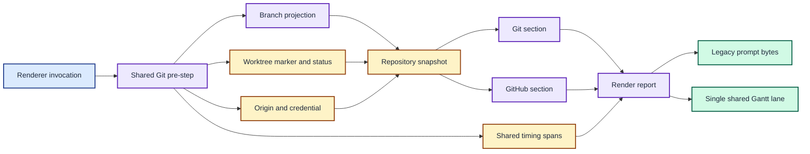

# ADR 0010: Build one shared Git pre-step

| Status | Date |
| --- | --- |
| Accepted | 2026-08-14 |

## Context

[ADR 0009](0009-parallelise-and-coalesce-prompt-probes.md) coalesced identical
origin and credential commands, but Git and GitHub still orchestrated their own
repository discovery. Their detailed timing lanes repeated branch, credential,
and worktree concepts even when the underlying command result was shared.

The two legacy helpers use different commands for branch and worktree data.
Those commands are implementation details rather than output contracts. Git
needs the selected branch text and worktree status, while GitHub needs a branch
suitable for pull-request lookup and a non-empty worktree marker.

## Decision

Build one invocation-scoped repository snapshot before the Git and GitHub
sections assemble their output. The first consumer starts the pre-step and the
other waits for the same immutable result. The pre-step runs branch detection,
worktree validation, worktree inspection, and origin lookup concurrently, then
runs credential lookup after resolving the origin.

Use the legacy Git helper's `git branch` output as the common branch source.
Preserve that selected text for Git. Project detached-HEAD forms beginning with
`(HEAD detached ` or `(no branch, ` to `HEAD` for GitHub, matching GitHub's
existing early-return behaviour. Normal branch names pass through unchanged.

Keep worktree validation and worktree inspection as separate commands because
an empty short status means either a clean repository or a failed command. Run
both once in the shared pre-step rather than independently in the two sections.

Return a render report containing the six ordered section results plus
invocation-level shared timing spans. Render those spans once under a
`shared git pre-step` lane in the detailed Mermaid trace. Keep the summary
trace, timing table, prompt rollup, and named section output shapes unchanged.

Do not retain the repository snapshot across invocations. A named Git or GitHub
command creates its own snapshot because it bypasses the multi-section
renderer and has only one consumer.

This decision supersedes ADR 0009's per-command coalescing boundary for the Git
and GitHub repository inputs. Its dependency-aware parallel comparison phases
remain in force.

One pre-step produces one repository snapshot and one timing lane for both consumers.

## Consequences

Git and GitHub no longer duplicate repository orchestration. Branch detection,
origin lookup, credential lookup, worktree validation, and worktree inspection
each start at most once per renderer invocation.

The pre-step performs read-only work that one consumer might not need on an
early-return path. In return, both sections can start immediately against one
coherent repository view without serialising the slow GitHub account lookup.

Detached and rebasing states need explicit projection tests because Git and
GitHub consume different branch representations. The live differential check
continues to protect the current environment, while complete-output fixtures
protect known permutations.
