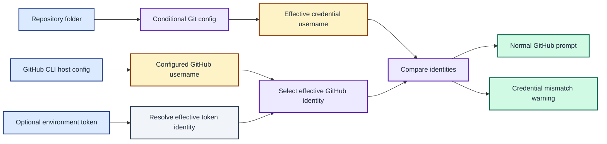

# ADR 0011: Compare configured GitHub identity with Git credentials

| Status | Date |
| --- | --- |
| Accepted | 2026-08-14 |

## Context

The GitHub prompt section used `gh auth status` to obtain the active account.
That command also verifies authentication and OAuth scopes over the network.
The prompt does not need an authentication health check: its purpose is to
warn when the GitHub CLI identity is incoherent with the credential selected by
folder-conditioned Git configuration.

Git can select credentials per directory through conditional configuration,
while the GitHub CLI normally exposes one active account per host. Revalidating
that account on every prompt render added network latency without strengthening
the identity comparison.

## Decision

Read the normal GitHub identity with
`gh config get user --host github.com`. Start that local lookup concurrently
with the shared repository pre-step, which resolves the repository origin and
then reads `credential.username` through Git's effective configuration. Compare
the two completed usernames and preserve the existing mismatch warning bytes.

Do not validate the configured GitHub token or its scopes as part of the
coherence check. A later `gh pr view` call, when the current branch requires
one, naturally exercises the credential needed for that operation.

When `GH_TOKEN` or `GITHUB_TOKEN` is present, it overrides the account stored by
the GitHub CLI. In that exceptional path, resolve the effective runtime identity
with one `gh api user --jq .login` request. This avoids comparing Git credentials
against an inactive global account. A failed identity resolution yields the
section's existing empty-output fallback.

This decision supersedes ADR 0008's GitHub account-operation label, ADR 0009's
description of the account lookup as intrinsically slow, and the legacy helper's
authentication-validation side effect. It does not change the normal successful
prompt bytes governed by ADR 0002.

The prompt compares the directory-effective Git identity with the effective GitHub CLI identity without validating normal-path authentication.

## Consequences

The common path avoids a network request and overlaps two local identity reads.
On the measured repository, the warmed GitHub section fell from about 428 ms to
42 ms, with 33 ms spent reading the configured account.

A configured username may refer to an expired or revoked token. That is
intentional: identity coherence and authentication health are separate concerns.
The environment-token path still needs one API request because a token does not
contain a locally readable canonical login.

The normal successful output remains byte-compatible. Offline or invalid global
credentials can now display their configured username instead of disappearing,
because the prompt no longer treats network validation as an identity source.
