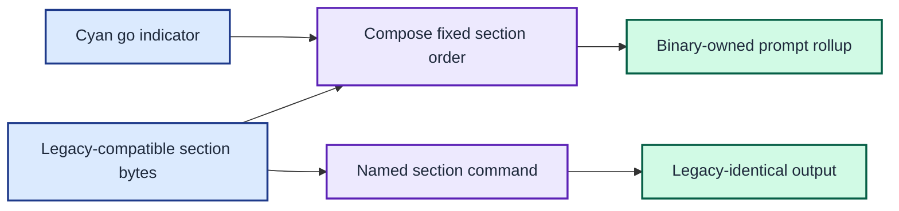

# ADR 0012: Mark binary-owned prompt rollups

| Status | Date |
| --- | --- |
| Accepted | 2026-08-14 |

## Context

The Go renderers reproduce the legacy helper bytes closely enough that a user
cannot tell whether a temporary shell is exercising the binary or the sourced
zsh functions. That ambiguity makes interactive migration testing harder: a
correct-looking prompt is not evidence that the new execution path loaded.

The compatibility oracle is still valuable for individual prompt sections.
Changing every section would weaken the differential tests and make each named
command less useful for diagnosing parity.

## Decision

Prefix only the top-level prompt rollup with
` %F{cyan}[go]%F{rc}%K{rc}`. This renders a cyan `[go]` indicator on the prompt
header line and identifies the Go composition path.

Keep all named section commands byte-identical to their legacy helpers. Keep
timing tables and Mermaid traces unchanged. Continue to run the differential
compatibility check against the six named section commands.

This decision introduces an intentional exception to ADR 0002 for `prompt` and
the no-argument default command. It does not supersede the per-section byte
contract.

The binary marks only composed prompt output while named sections remain compatible with the legacy oracle.

## Consequences

A temporary prompt visibly proves that the Go rollup is active. The marker is
plain ASCII inside existing zsh colour tokens, so it does not require a Nerd
Font or introduce a new terminal capability.

The complete rollup is intentionally no longer byte-identical to concatenated
legacy helper output. Consumers that require legacy bytes can still invoke the
named section commands independently.

Tests must assert the marker in `Compose` and CLI prompt output. Compatibility
checks must continue to exclude the rollup and compare each named section.
