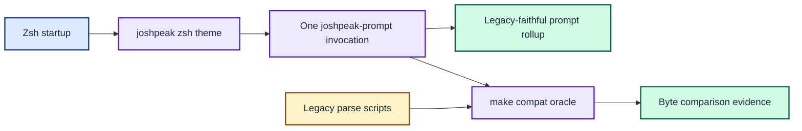

# ADR 0013: Adopt the binary in the zsh theme

| Status | Date |
| --- | --- |
| Accepted | 2026-08-14 |

## Context

ADR 0012 added a temporary `[go]` marker so an interactive shell could prove
that its prompt was rendered by the new executable. The temporary trial
confirmed that the Go rollup was faithful to the existing prompt.

Leaving the marker in place would turn a migration aid into a permanent visual
change. Continuing to source the six legacy render functions would also keep
dead startup work after the theme switched to the binary.

## Decision

Remove the temporary `[go]` marker and restore the composed prompt's original
bytes. Update `joshpeak.zsh-theme` to invoke `joshpeak-prompt prompt` once where
it previously invoked six parse functions.

Resolve the executable from `JOSHPEAK_PROMPT_BIN` when set, otherwise use
`$HOME/dotfiles/joshpeak-prompt/bin/joshpeak-prompt`. This keeps the installed
theme simple while permitting an explicit alternate binary during development.

Stop sourcing the six `function_parse_*` files from `zsh/.zshrc`. Retain the
files as the compatibility oracle used by `make compat`; they are no longer part
of interactive shell startup. Remove the obsolete `set_git_branch` precmd hook;
the binary obtains its own invocation-scoped branch snapshot and nothing else
consumes the exported `GIT_BRANCH` value.

This decision supersedes ADR 0012. ADR 0002's byte contract once again applies
to both named sections and their composed rollup.

Interactive shells use one binary invocation while legacy scripts remain available only as test oracles.

## Consequences

The production prompt is visually indistinguishable from the legacy prompt by
design. The theme no longer serially starts six shell functions or runs a
separate branch-detection hook, and prompt-section concurrency is owned entirely
by the Go renderer.

The binary must be built before starting a shell that uses the theme. A missing
or non-executable binary is visible as a prompt-time command failure rather than
silently falling back to legacy behaviour.

Changing `JOSHPEAK_PROMPT_BIN` before theme loading selects another build without
editing the theme. The legacy helpers can evolve only as compatibility fixtures,
not as a second active runtime implementation.
