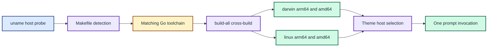

# ADR 0014: Support Linux and commit per-architecture binaries

| Status | Date |
| --- | --- |
| Accepted | 2026-08-15 |

## Context

ADR 0005 limited the support promise to `darwin/arm64` and `darwin/amd64` and
bootstrapped only macOS toolchains. A Raspberry Pi 4 running 64-bit Raspberry Pi
OS (`linux/arm64`) now needs to run the same prompt. The renderer code already
uses portable Go APIs, so the gap was entirely in the build and runtime-selection
plumbing:

- The Makefile hard-coded the `darwin` toolchain archive and the macOS-only
  `shasum` checksum tool.
- `build-all` cross-built only the two macOS targets.
- The committed `bin/joshpeak-prompt` was a single macOS binary that cannot
  execute on Linux.
- ADR 0013 resolved a single fixed binary path, which cannot serve two host
  architectures from one checked-out dotfiles tree.
- The Go race detector aborts on this host: `linux/arm64` ThreadSanitizer
  requires a 48-bit-VMA kernel, but the Raspberry Pi OS kernel uses a 39-bit
  layout (`FATAL: ThreadSanitizer: unsupported VMA range. Found 39 - Supported 48`).

## Decision

Support `darwin/arm64`, `darwin/amd64`, `linux/arm64`, and `linux/amd64`.

Detect the host operating system and architecture in the Makefile (`uname -s`,
`uname -m`), select the matching pinned Go toolchain archive and its verified
SHA-256, and choose the checksum tool per host (`shasum -a 256` on macOS,
`sha256sum` on Linux). Extend `build-all` to cross-build all four targets.

Commit the four per-architecture release binaries
(`bin/joshpeak-prompt-<os>-<arch>`) and stop tracking the unsuffixed
`bin/joshpeak-prompt`, which becomes a local `make build` artifact. The zsh
theme resolves its binary once at load: an explicit `JOSHPEAK_PROMPT_BIN` wins,
otherwise it maps the host to `bin/joshpeak-prompt-<os>-<arch>` and falls back to
the unsuffixed local build. This revises the fixed-path resolution from ADR 0013
while keeping its one-invocation-per-prompt contract.

Probe race-detector support before the `check` gate runs it. On hosts where the
detector cannot initialise (such as a 39-bit-VMA kernel), run the tests without
`-race` and emit a loud warning instead of failing the gate.

Host detection drives one toolchain, four committed binaries, and a runtime
selection that still issues one prompt invocation per host.

This decision supersedes ADR 0005 and revises the binary-path resolution in
ADR 0013. ADR 0002's byte contract and ADR 0001's concurrency guarantees are
unchanged; `make compat` remains byte-identical on Linux.

## Consequences

The same Makefile bootstraps macOS and Linux, and `make check`, `make build`,
and `make compat` were verified on `linux/arm64` (Raspberry Pi 4) with every
section byte-identical to the legacy zsh helpers. The repository carries four
release binaries, so a checkout runs on any supported host without a local build.

The race detector no longer runs on 39-bit-VMA hosts; those hosts still run the
full test suite and coverage gate without it, and any host that supports the
detector continues to enforce it. New supported platforms require adding their
toolchain checksum and a `build-all` target, then committing the new binary.
