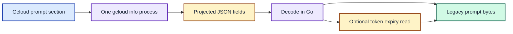

# ADR 0015: Fetch gcloud prompt fields in one CLI call

| Status | Date |
| --- | --- |
| Accepted | 2026-10-04 |

## Context

The gcloud prompt section launched three concurrent `gcloud info` processes.
Each process requested one field: the config directory, account, or project.
Their similar durations suggested repeated CLI startup work, although the timing spans cannot identify internal SDK phases.

Nine interleaved local trials averaged 0.562 s for the three parallel calls.
One projected JSON call averaged 0.429 s.
Requests for `json(config)` and full `json` averaged 0.430 s and 0.432 s.
All three JSON forms yielded the required fields, including an absent project.
The timings were collected in a restricted environment, so they are evidence for this host rather than a universal performance guarantee.

## Decision

Run one `gcloud info --format=json(config.paths.global_config_dir,config.account,config.project)` process per prompt render.
Decode the nested JSON in Go and keep empty values when the CLI returns no valid result.
Read token expiry from the local database only after resolving a nonempty account.

Choose the narrow projection because the larger JSON forms had no measured speed advantage and emitted more data.
Keep subprocess output and field values out of timing labels.

One CLI result supplies all three config fields before the optional local token read.

## Consequences

The gcloud section records one CLI timing span and one optional token-read span.
The selected binary averaged 0.467 s across nine interleaved runs, compared with 0.576 s for the previous binary.
The old and new binaries produced identical gcloud output on this host, and `make compat` matched the legacy helper.

JSON decoding adds a small local step, while one CLI process avoids two launches.
The runner still discards CLI errors, so timing data alone cannot establish why an individual SDK invocation was slow.
