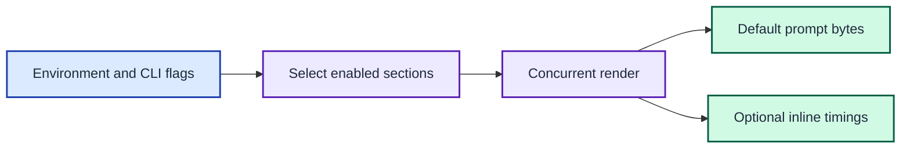

# ADR 0016: Control prompt sections and inline timings

| Status | Date |
| --- | --- |
| Accepted | 2026-10-04 |

## Context

The prompt renders six sections concurrently. A slow section can make the
whole prompt slow, and the existing `timings` command is separate from the
prompt text. A user needs to isolate sections and see their durations during
normal rendering.

## Decision

Treat a section's `JOSHPEAK_PROMPT__DISABLE_<NAME>=1` environment variable
and its `--disable-<name>` CLI flag as additive controls. Filter sections
before rendering, so a disabled section cannot launch its subprocesses. Use
the six existing section names. A named disabled command emits nothing.

Treat `JOSHPEAK_PROMPT__DEBUG_TIMINGS=1` as an opt-in prompt format that
appends each enabled section's duration and the whole render's wall duration.
Read variables on every invocation. Keep the default prompt composition and
byte contract from [ADR 0002](0002-treat-legacy-output-as-a-byte-contract.md).

Filtering precedes the subprocess work. Formatting follows the completed render.

## Consequences

Disabling all six sections renders an empty prompt line. With debug timing
enabled, that line contains only the total duration. Section durations can
overlap, so their sum need not equal the wall duration. Unknown disable names
return a CLI error.
