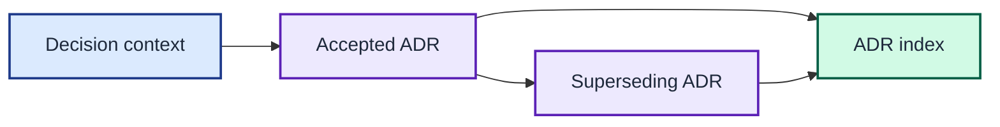

# Architecture decision records

Accepted decisions are immutable. Create a new record that links to and
supersedes an earlier decision when the project changes direction.

Each accepted decision remains immutable and is replaced only by an indexed superseding ADR.

| Number | Decision | Status | Date |
| --- | --- | --- | --- |
| [0001](0001-preserve-output-with-concurrent-renderers.md) | Preserve output with concurrent renderers | Accepted | 2026-08-14 |
| [0002](0002-treat-legacy-output-as-a-byte-contract.md) | Treat legacy output as a byte contract | Accepted | 2026-08-14 |
| [0003](0003-keep-development-state-under-project-tmp.md) | Keep development state under project tmp | Accepted | 2026-08-14 |
| [0004](0004-keep-domain-clis-and-embed-sqlite.md) | Keep domain CLIs and embed SQLite | Accepted | 2026-08-14 |
| [0005](0005-target-macos-with-portable-go-boundaries.md) | Target macOS with portable Go boundaries | Superseded by [0014](0014-support-linux-and-commit-per-architecture-binaries.md) | 2026-08-14 |
| [0006](0006-make-documentation-an-agent-maintained-system.md) | Make documentation an agent-maintained system | Accepted | 2026-08-14 |
| [0007](0007-export-relative-timing-traces-as-fenced-mermaid.md) | Export relative timing traces as fenced Mermaid | Accepted | 2026-08-14 |
| [0008](0008-record-non-sensitive-hierarchical-subprocess-spans.md) | Record non-sensitive hierarchical subprocess spans | Accepted | 2026-08-14 |
| [0009](0009-parallelise-and-coalesce-prompt-probes.md) | Parallelise and coalesce prompt probes | Accepted | 2026-08-14 |
| [0010](0010-build-one-shared-git-pre-step.md) | Build one shared Git pre-step | Accepted | 2026-08-14 |
| [0011](0011-compare-configured-github-identity-with-git-credentials.md) | Compare configured GitHub identity with Git credentials | Accepted | 2026-08-14 |
| [0012](0012-mark-binary-owned-prompt-rollups.md) | Mark binary-owned prompt rollups | Accepted | 2026-08-14 |
| [0013](0013-adopt-the-binary-in-the-zsh-theme.md) | Adopt the binary in the zsh theme | Accepted | 2026-08-14 |
| [0014](0014-support-linux-and-commit-per-architecture-binaries.md) | Support Linux and commit per-architecture binaries | Accepted | 2026-08-15 |
