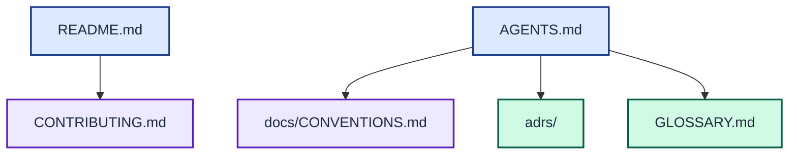

# Documentation conventions

This file declares how the project organises its documentation. Agents and
humans consult it before creating, moving, or renaming a document.

The root documents route users and agents to contributor guidance, documentation conventions, decisions, and canonical terminology.

## Dialect

- **Flavour:** Standard, defaulted for a maintained tool with downstream use.
- **Docs taxonomy:** A thin root README and flat topic files under `docs/` until
  the tree exceeds ten topic files.
- **Glossary:** `GLOSSARY.md` contains one canonical term per concept.
- **ADR layout:** File-per-decision under `adrs/NNNN-short-name.md`, with an
  index in `adrs/README.md`.
- **Agent files:** `AGENTS.md` is canonical and `CLAUDE.md` is its symlink.
- **Changelog:** Add `CHANGELOG.md` with the first versioned release.
- **Proposals:** Do not use proposals until decisions need review before
  acceptance.

## Layout map

| Path | Charter | Audience | Changes when |
| --- | --- | --- | --- |
| `README.md` | Orientation, quickstart, and outward routing | Users | Purpose or entry points change |
| `ARCHITECTURE.md` | Runtime structure, data flow, concurrency, and build boundaries | Contributors and agents | Components, integrations, or build boundaries change |
| `CONTRIBUTING.md` | Setup, checks, builds, and change requirements | Contributors | Development workflow changes |
| `AGENTS.md` | Agent invariants and pointers | Agents | Commands or hard boundaries change |
| `adrs/` | Immutable accepted decisions and their index | Contributors and agents | A binding decision is accepted or superseded |
| `GLOSSARY.md` | One canonical term and definition per concept | Contributors and agents | A domain term enters the project |
| `docs/` | Living technical topics and documentation conventions | Users and contributors | A detailed topic changes |

Every project-authored Markdown document includes a Mermaid diagram that serves
its charter. APM-installed content under `.agents/` retains its upstream form.

## Naming

- Root meta-files use uppercase names.
- Files inside `docs/` use lowercase kebab-case.
- ADR files use a four-digit prefix and a kebab-case title.
- Point-in-time findings include an ISO date in the filename.

## Pointers

- ADR directory: `adrs/`
- Documentation source: `docs/`
- Diagram conventions: use inline Mermaid diagrams with the project-required `mermaidjs_diagrams` skill and its validation gates

## Required cross-links

- `AGENTS.md` links to this file, the ADR index, and the glossary obligations.
- `README.md` links to `CONTRIBUTING.md`.
- The ADR index lists every decision file.
- Mermaid diagrams pass the complexity and WCAG contrast gates.

## Split triggers

- Adopt Diátaxis directories after `docs/` exceeds ten topic files or mixes
  genres that readers confuse.
- Add a nested agent file when a rule applies to only one non-trivial subtree.
- Split the glossary after it exceeds 100 terms or serves multiple domains.
