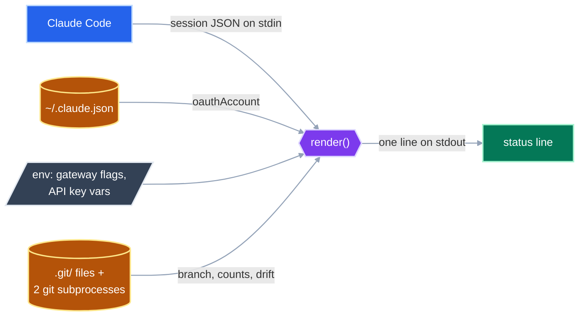
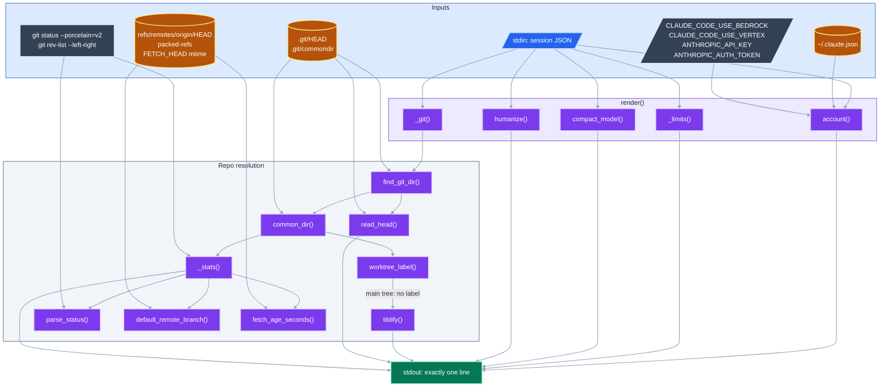
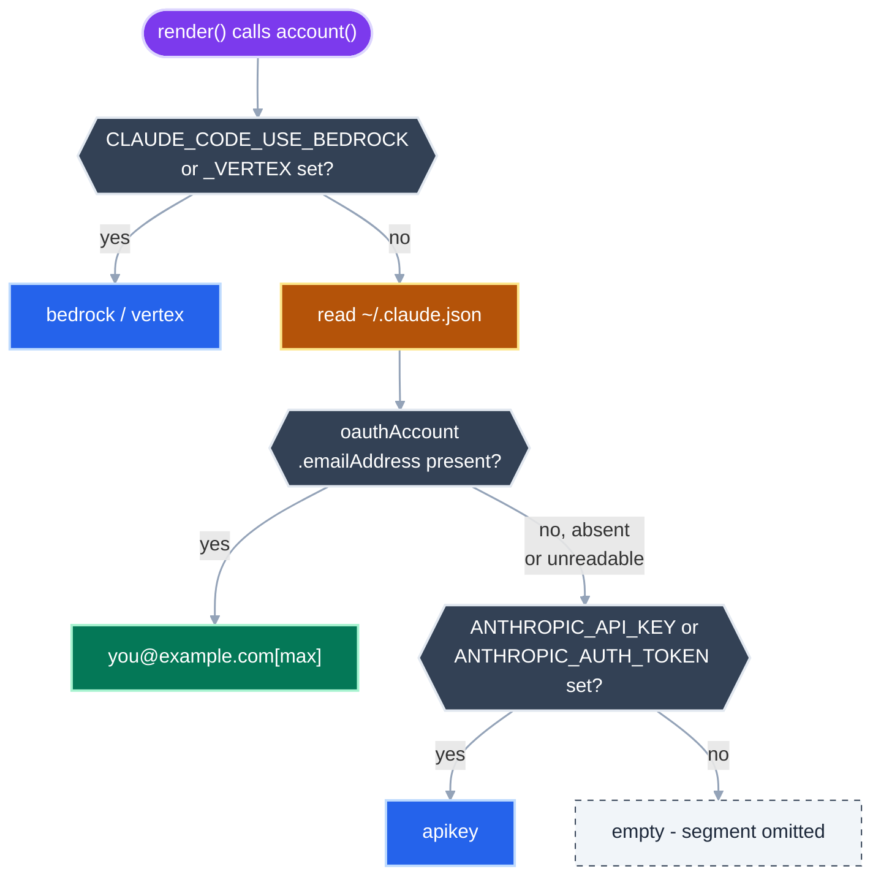
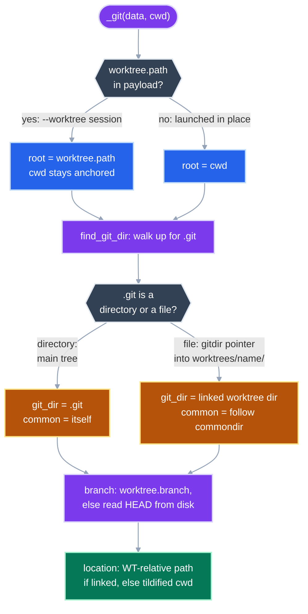

# Claude Code status line

`statusline.py` renders the one-line status bar Claude Code prints beneath the
prompt. Claude Code pipes a JSON session payload to the script's stdin on every
render and displays the first line of stdout.

```
joshpeak05@gmail.com[max] v2.1.7 [5h:41% | 7d:12%][Opus5] I:148k|O:2k | ~/dotfiles | main *2 ?2
```

Wired up in `~/.claude/settings.json`:

```json
{ "statusLine": { "type": "command", "command": "uv run ~/dotfiles/scripts/claude/statusline.py" } }
```

## Contents

| File | Role |
|------|------|
| `statusline.py` | The renderer. PEP-723 script, stdlib only, `uv run` shebang. |
| `test_statusline.py` | 82 tests. Builds real `.git` layouts under `tmp_path` rather than mocking. |
| `_settings.json` | The `~/.claude/settings.json` fragment that wires the script in. |
| `statusline.sh` | A `jq` predecessor, kept for reference. Nothing points at it. |

---

## System Overview

Four independent sources feed one pure-ish render pass. Only the payload arrives
on stdin; everything else the script reaches out and reads for itself.



*Blue = the payload, amber = on-disk state, slate = process environment, violet = logic, green = the only output.* | VCS: 8.5 ✅

<details>
<summary>📋 Complete diagram (21 nodes) — every reader and the functions that call them</summary>



*21 nodes, 30 edges, 3 subgraphs* | VCS: 49.5 ✅

</details>

---

## Inputs

| # | Source | Read by | Provides | When it fails |
|---|--------|---------|----------|---------------|
| 1 | **stdin** JSON payload | `main()` -> `render()` | version, model, token counts, rate limits, cwd, harness worktree | Never — Claude Code always sends it |
| 2 | **`~/.claude.json`** -> `oauthAccount` | `account()` | signed-in email + plan tier | Segment falls through to env, then omits |
| 3 | **Environment** | `account()` | gateway flags, API-key vars | Absent is the normal case |
| 4 | **`.git/` files** | `find_git_dir()`, `read_head()`, `common_dir()`, `default_remote_branch()`, `fetch_age_seconds()` | branch, worktree layout, remote default, fetch age | Outside a repo the whole git segment is omitted |
| 5 | **`git` subprocesses** | `_run_git()` | staged/modified/untracked/conflict counts, ahead/behind, drift | Renders `git?` — a visible failure, never a silent blank |

Every field is treated as optional. Fields the docs mark nullable are *present
with a `null` value*, which `.get(k, default)` will not replace — hence
`.get(k) or default` throughout.

### Payload fields actually consumed

`version` · `model.display_name` · `context_window.total_input_tokens` ·
`context_window.total_output_tokens` · `rate_limits.five_hour.used_percentage` ·
`rate_limits.seven_day.used_percentage` · `cwd` · `worktree.path` ·
`worktree.branch` · `workspace.git_worktree`

The full documented schema, including the ~30 fields the script deliberately
ignores, is transcribed in the `statusline.py` module docstring.

### Two git subprocesses, not one

`_stats()` shells out twice because the two questions are genuinely different:

- `git status --porcelain=v2 --branch` — file states plus ahead/behind **your own upstream**.
- `git rev-list --left-right --count <default>...HEAD` — how far **`origin/main`** has moved past you.

A branch can be fully pushed (`↑0 ↓0`) while `origin/main` is 40 commits ahead.
That is the `M↓` marker, and it is the one the first command cannot answer.

Both run with `GIT_OPTIONAL_LOCKS=0`. That is load-bearing, not cosmetic:
`git status` would otherwise take the index lock to refresh stat info on every
single render, contending with whatever git command you or an agent are running.

---

## Output

One line on stdout. Square brackets below mark optional segments:

```
[account ]v<version>[ [5h:N% | 7d:N%]][<Model>] I:<in>|O:<out> | <location>[ | <branch>[ <stats>]]
```

| Segment | Example | Omitted when |
|---------|---------|--------------|
| account | `you@example.com[max]` | Not signed in and no auth env vars |
| version | `v2.1.7` | Never |
| rate limits | `[5h:41% \| 7d:12%]` | Not a Claude.ai subscription, or before the first API response |
| model | `[Opus5]` | Never — parenthetical variant tags are stripped |
| tokens | `I:148k\|O:2k` | Never — defaults to `I:0\|O:0` |
| location | `~/dotfiles` or `WT: ../hotfix` | Never |
| branch | `main` | Outside a git repository |
| stats | `*2 ?1 M↓7` | Clean tree with no divergence |

### Git markers, in render order

| Marker | Meaning |
|--------|---------|
| `!3` | Unmerged (conflicted) paths |
| `+2` | Staged changes |
| `*4` | Modified in the working tree |
| `?1` | Untracked files |
| `↑2` | Ahead of upstream |
| `↓1` | Behind upstream |
| `M↓7` | Behind the remote default branch — needs a resync |
| `@3h` | Age of the last fetch, shown only once stale (>15 min) **and** only alongside other markers |
| `git?` | A git call failed |

`@3h` is the honesty marker: every number derived from a remote-tracking ref is
only as fresh as the last `git fetch`. Without it the status line would imply it
knows the remote's current state when it may be reading day-old refs.

### `location` is two different answers

`~/dotfiles` is a tildified absolute path. `WT: ../hotfix` means you are in a
linked worktree, and the path is rendered **relative to the main repo root** —
the `WT:` prefix carries the "you are in a worktree" signal, so the worktree's
own name never has to be spelled out, and the repo prefix that would be
identical on every render is dropped.

---

## Account resolution

The account is the one segment sourced from the machine rather than the payload.
`account()` resolves it fresh on every render — deliberately uncached, because a
TTL would keep displaying the previous account for the length of that TTL, stale
at exactly the moment the segment exists to catch.



**Why the login outranks a bare API key.** Both can be set at once — a key
exported for some other tool while Claude Code runs on a subscription — and in
that ambiguity the login is overwhelmingly the truth. A status line that
confidently names the wrong payer is a worse failure than one that under-reports
an edge case. The gateway flags carry no such ambiguity: they exist only to
route Claude Code itself, so they win outright.

`json.loads` is wrapped in `except (OSError, ValueError, AttributeError)`
because Claude Code rewrites that file live — a render can genuinely land on
half of it.

---

## Repo resolution

There are two unrelated ways a session ends up on a worktree, and the payload
reports them differently. Getting this wrong reports the *original* repo's
branch, which is why `worktree.path` wins over `cwd`.



The payload carries no branch for the "launched inside a worktree folder" case
(`worktree.branch` is populated only for harness `--worktree` sessions), so
`read_head()` reads `.git/HEAD` from disk as the default path.

`common_dir()` matters because a linked worktree's git dir holds only
per-worktree state (HEAD, index). The refs and `FETCH_HEAD` that every worktree
shares live in the common dir, named by a `commondir` file whose contents are
relative to the worktree git dir.

---

## Development

```bash
# Run the suite (PEP-723 pulls pytest automatically)
uv run scripts/claude/test_statusline.py -q

# Render a payload by hand
echo '{"model":{"display_name":"Opus 5"},"context_window":{},"cwd":"'"$PWD"'","version":"2.1.7"}' \
  | uv run scripts/claude/statusline.py
```

### Testing conventions

Git tests build real `.git` structures under `tmp_path` rather than mocking, so
the main-tree vs linked-worktree distinction is exercised the way git actually
lays it out on disk. The account tests do the same thing for identity: an
autouse `empty_home` fixture points `HOME` at a scratch directory, so "not
logged in" is a genuinely empty home rather than a stand-in for one, and tests
that care about the segment write a real `.claude.json` into it.

That fixture gets its **own subdirectory** of `tmp_path` rather than `tmp_path`
itself — otherwise the git fixtures would build their repos *inside* home and
every repo path would tildify to `~/repo`, quietly turning the absolute-path
assertions into tests of the fixture layout.

Nothing in the suite uses `unittest.mock`. `account()` takes `config` and `env`
as injectable parameters and resolves their defaults inside the body, so tests
exercise the real function against a real file under a real `HOME`. Defaulting
them in the signature would bind `Path.home()` and `os.environ` once at import
and defeat that.

### Diagram gates

Both must pass before a diagram in this file is considered done:

```bash
bun run ~/.claude/skills/mermaidjs-diagrams/scripts/mermaid_complexity.ts scripts/claude/README.md
bun run ~/.claude/skills/mermaidjs-diagrams/scripts/mermaid_contrast.ts scripts/claude/README.md
```

The palette encodes category by hue — blue for payload, amber for on-disk state,
slate for the process environment and decisions, violet for logic, green for
output — with a light shade-200 rim on every fill. The rim is not decoration:
the contrast gate requires 3:1 between border and fill, which the conventional
"600 fill, 800 stroke" pairing cannot reach.
