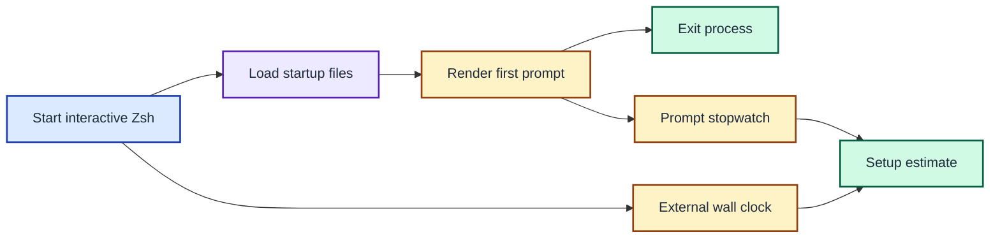
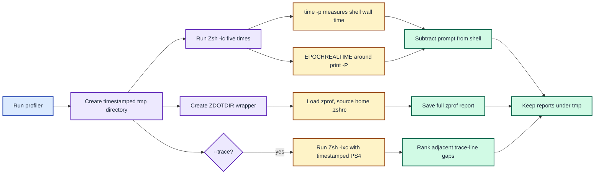

# Profile Zsh startup and the first prompt

`profile_startup.sh` measures a new interactive Zsh process through one explicit prompt render.
It also runs a separate function profile and, on request, a command trace.
The three measurements answer different questions and should not be added together.

## The wall clock includes setup and one prompt

What does one row of the five-run table measure?



**Takeaway:** `Setup` is external wall time minus the measured prompt expansion.
It is an estimate that also includes process creation, measurement commands, and exit.

<details>
<summary>Complete probe flow</summary>



</details>

## Run the profiler from the repository root

```console
$ zsh/scripts/profile_startup.sh
$ zsh/scripts/profile_startup.sh --trace
```

The script creates `tmp/shell-startup-YYYYMMDD-HHMMSS/` for each run.
It keeps the full reports so that the short terminal output does not hide evidence.

| Stage | What the script does | Output |
| --- | --- | --- |
| Directory | Resolves the repository root from the script path and makes a timestamped `tmp/` directory. | One directory per invocation. |
| Five samples | Starts `/bin/zsh -ic` five times with the real startup files. | `run-1.out` through `run-5.out` and matching `.err` files. |
| Shell stopwatch | `/usr/bin/time -p` measures each process through prompt render and exit. | `Shell`, rounded to hundredths of a second by `time`. |
| Prompt stopwatch | `zsh/datetime` supplies `EPOCHREALTIME` around `print -P "$PROMPT"`. | `Prompt`, including prompt substitutions such as the Go binary. |
| Setup estimate | Subtracts the measured prompt interval from shell wall time. | `Setup`, which also contains small process and probe overhead. |
| Function profile | A temporary `ZDOTDIR/.zshrc` loads `zsh/zprof` before sourcing the real `~/.zshrc`. | Full `zprof.txt`; startup errors in `zprof.err`. |
| Optional trace | `-x` writes expanded commands with a timestamped `PS4`; Python ranks adjacent timestamp gaps. | Full `trace.err`, `trace.out`, and ten printed gaps. |

The function profile does not render the prompt.
Its totals cover shell startup functions, while the five sample rows also cover one prompt render.
The `ZDOTDIR` wrapper does not source a login shell's `.zprofile`.
Use the five sample rows to assess the script's normal interactive path.
For login-shell startup, measure `zsh -lic` separately.

Trace mode can be much slower because it records every expanded command.
Use its large gaps to choose lines to investigate, not as normal startup timings.
`trace.err` may contain expanded secrets, so review it locally before sharing it.

## Gcloud now runs one CLI process

What happens inside the Go prompt's gcloud section?

| Span | Operation |
| --- | --- |
| `fetch gcloud info` | Runs `gcloud info --format=json(config.paths.global_config_dir,config.account,config.project)` once. |
| `read token expiry` | Reads `<config>/access_tokens.db` through embedded SQLite when an account exists. |

The CLI span includes process launch, SDK startup, config lookup, and command exit.
Go decodes the three fields from the JSON result, then performs the token read and formatting.
The recorder does not separate the internal SDK phases.
The Go runner discards command errors, so run an individual `gcloud info` command directly when checking its stderr and exit status.
Run `joshpeak-prompt/bin/joshpeak-prompt-darwin-arm64 timings --detail` from the repository root to inspect the current spans.

Nine interleaved runs on 2026-10-04 compared the CLI formats in a restricted environment.

| `gcloud info` format | Average wall time | Output size |
| --- | ---: | ---: |
| Three parallel `value(...)` calls | 0.562 s | Three small results |
| Projected `json(config.paths.global_config_dir,config.account,config.project)` | 0.429 s | 155 bytes |
| `json(config)` | 0.430 s | 1,105 bytes |
| Full `json` | 0.432 s | 5,271 bytes |

The JSON variants were effectively tied, so the prompt uses the narrow projection.
The same host's old and new Go binaries averaged 0.576 s and 0.467 s for the gcloud command.
See [ADR 0015](../../joshpeak-prompt/adrs/0015-fetch-gcloud-info-once.md) for the decision.

## Nvm now selects a version once

The real [.zshrc](../.zshrc) sources [aliases_work.sh](aliases_work.sh) near its start.
The nvm source in that alias file is now commented out.
The `.zshrc` sources `/opt/homebrew/opt/nvm/nvm.sh` once, then sources nvm's completion script.
It checks for the `nvm` and `__nvm` shell functions before sourcing either file again.
It also preserves an existing `NVM_DIR` value.
The checks apply within one shell; a new shell still initializes nvm for itself.
On source, nvm runs `nvm_process_parameters`, whose default mode calls `nvm_auto use`.
It resolves the current or default version and runs `nvm use --silent` when appropriate.

The 2026-10-02 `zprof` sample recorded two `nvm_auto` calls totalling 1,014 ms inclusive.
The 2026-10-04 sample recorded one call taking 516 ms inclusive.
Those values include nested `nvm` calls and cannot be added to their child rows.

| Median of five runs | Before: 2026-10-02 | After: 2026-10-04 |
| --- | ---: | ---: |
| Shell through first prompt | 2.16 s | 1.61 s |
| Prompt expansion | 0.605 s | 0.572 s |
| Setup estimate | 1.555 s | 1.029 s |

Both samples were collected in a restricted environment that blocked some cache writes.
Run the profiler in Terminal for timings under normal permissions.

## All zprof functions as duration bars

This chart preserves all 37 function rows from the 2026-10-02 before-change `zprof.txt` sample.
`zprof` reports aggregate inclusive durations and call counts, but no start timestamps.
Every bar therefore starts at an artificial zero and compares duration only.
Bars do **not** show startup order, concurrency, or a critical path.
Nested calls overlap, and sub-millisecond durations are rounded up to one millisecond for visibility.
This sample had sandbox errors for completion cache and pyenv writes, so rerun in Terminal for host timings.

```mermaid
%%{init: {"theme":"base","themeVariables":{"taskBkgColor":"#1e40af","taskBorderColor":"#dbeafe","taskTextColor":"#ffffff","taskTextOutsideColor":"#1e293b","sectionBkgColor":"#dbeafe","sectionBkgColor2":"#f1f5f9","sectionTextColor":"#1e293b"}}}%%
gantt
    title zprof inclusive durations from a shared zero baseline, not chronology
    dateFormat x
    axisFormat %S.%L
    tickInterval 100millisecond
    section nvm
    01 nvm (4 calls) :f1, 0, 955ms
    02 nvm_ensure_version_installed (2 calls) :f2, 0, 406ms
    06 nvm_auto (2 calls) :f6, 0, 1014ms
    07 nvm_is_version_installed (2 calls) :f7, 0, 49ms
    08 nvm_die_on_prefix (2 calls) :f8, 0, 54ms
    13 nvm_grep (2 calls) :f13, 0, 9ms
    16 nvm_has (2 calls) :f16, 0, 3ms
    17 nvm_npmrc_bad_news_bears (8 calls) :f17, 0, 11ms
    29 nvm_hash_reset (2 calls) :f29, 0, 1ms
    32 nvm_process_parameters (2 calls) :f32, 0, 1014ms
    36 nvm_is_zsh (2 calls) :f36, 0, 1ms
    section completion
    03 compinit (1 call) :f3, 0, 322ms
    04 compdef (818 calls) :f4, 0, 77ms
    05 compdump (1 call) :f5, 0, 67ms
    11 zrecompile (1 call) :f11, 0, 15ms
    12 compaudit (2 calls) :f12, 0, 13ms
    24 bashcompinit (3 calls) :f24, 0, 1ms
    27 complete (2 calls) :f27, 0, 1ms
    28 _build_kubectl_out_alias (3 calls) :f28, 0, 1ms
    34 _omz_compdump_has_metadata (1 call) :f34, 0, 1ms
```

```mermaid
%%{init: {"theme":"base","themeVariables":{"taskBkgColor":"#1e40af","taskBorderColor":"#dbeafe","taskTextColor":"#ffffff","taskTextOutsideColor":"#1e293b","sectionBkgColor":"#dbeafe","sectionBkgColor2":"#f1f5f9","sectionTextColor":"#1e293b"}}}%%
gantt
    title Other zprof inclusive durations from the same zero baseline
    dateFormat x
    axisFormat %S.%L
    tickInterval 100millisecond
    section other
    09 _omz_source (27 calls) :f9, 0, 44ms
    10 inject_path (4 calls) :f10, 0, 17ms
    14 __omz_test_cmd_args (2 calls) :f14, 0, 9ms
    15 grep-flags-available (1 call) :f15, 0, 4ms
    18 _omz_git_head (1 call) :f18, 0, 2ms
    19 regexp-replace (1 call) :f19, 0, 1ms
    20 colors (1 call) :f20, 0, 1ms
    21 is-at-least (7 calls) :f21, 0, 1ms
    22 add-zsh-hook (5 calls) :f22, 0, 1ms
    23 spectrum anonymous (1 call) :f23, 0, 1ms
    25 autosuggestions anonymous (1 call) :f25, 0, 1ms
    26 is_plugin (11 calls) :f26, 0, 1ms
    30 appearance anonymous (1 call) :f30, 0, 5ms
    31 is_theme (2 calls) :f31, 0, 1ms
    33 env_default (2 calls) :f33, 0, 1ms
    35 oh-my-zsh anonymous (1 call) :f35, 0, 2ms
    37 prepend_path (1 call) :f37, 0, 1ms
```

<details>
<summary>All 37 function durations (two zero-aligned Gantt panels)</summary>





</details>

The numeric prefixes match row numbers in the captured `zprof.txt` report.
The chart uses inclusive time; inspect `self` in that report to find time spent inside a function body rather than its children.
